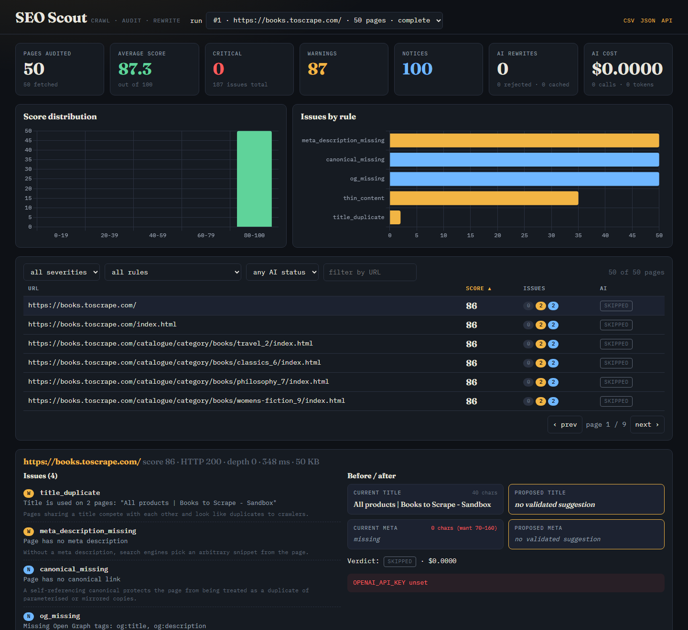
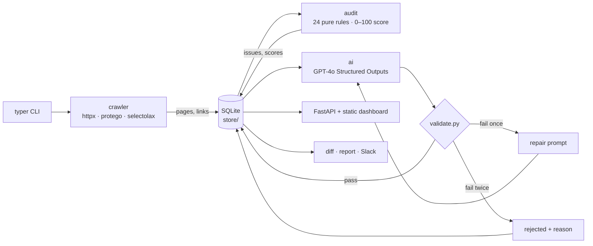

# SEO Scout

Crawl a website, audit every page against deterministic SEO rules, ask GPT-4o to rewrite the
weak titles and meta descriptions, **validate every answer before you see it**, and browse the
results in a dashboard. Self-hosted, one SQLite file, one command.



## Quickstart

You need [uv](https://docs.astral.sh/uv/). Install SEO Scout as a command, then three
commands:

```bash
uv tool install --python 3.12 git+https://github.com/Yataghanac/seo-scout
seo-scout init                                   # writes .env; add OPENAI_API_KEY to enable rewrites
seo-scout crawl https://books.toscrape.com --max-pages 50
seo-scout serve --open                           # opens the dashboard in your browser
```

`--python 3.12` makes uv fetch a suitable interpreter when the machine's default Python is
older; 3.13 works too. Working on the code instead? `git clone`, `uv sync`, and prefix every
command with `uv run` (see [Development](#development)).

What you will see:

- **Start here**: the five weakest pages and the one thing wrong with each. Work from the top.
- **Tiles and charts**: the overall score, issue counts by severity and by rule.
- **The table**: every page, filterable by severity, rule, AI status or URL. Click a page.
- **Before / after**: for each weak page, the current title and meta beside a validated
  rewrite with a copy button. A verdict line says whether the model passed first time,
  needed a repair, or was rejected, and why.

Without an API key everything above still works except the rewrites; the tool prints one
warning and moves on. A typical keyed run of 50 pages ends like this:

```
run 1: complete, 50 pages in 26.1s
audit: 50 pages, average score 87.3, 187 issues (100 notice, 87 warning)
ai: 50 pages considered, 50 ok, 0 repaired, 0 rejected, 0 cached, 0 skipped; 50 calls, $0.1153
next: seo-scout serve --open
```

To watch a site over time, schedule `seo-scout report https://example.com` instead of
`crawl`: it diffs against the last run, writes a report file and can post to Slack
(see [Run diffs and automation](#run-diffs-and-automation)).

Other commands: `seo-scout audit <run>` re-runs the rules, `seo-scout ai <run>` runs the AI
stage on a stored run, `seo-scout diff <a> <b>` compares two runs, `seo-scout report <url>`
crawls, diffs against the previous run and writes `reports/run-N.{json,md}`.
`--dry-run` prints the seed URLs and fetches nothing. `--help` on any command lists the rest.

## What it does



Layers point inward: `crawler` knows nothing about `ai`, `audit` knows nothing about HTTP,
`store` knows nothing about any of them. Rules and validators are pure functions, which is
what makes them table-testable. Every design decision has a plain-English entry in
[DECISIONS.md](DECISIONS.md).

## Crawling policy

The crawler is a good citizen, and none of this can be switched off:

- **robots.txt is fetched first** (parsed with `protego`, the parser Scrapy uses, because
  `urllib.robotparser` mishandles wildcards). `Crawl-delay` is honoured. A missing file allows
  everything; an unreachable file or a 5xx disallows everything and the run is marked failed.
- **Honest identification**: `User-Agent: SEOScout/0.1 (+https://github.com/Yataghanac/seo-scout)`.
- **Rate limited per host**: at most 2 concurrent requests and a minimum 0.5 s between
  request starts (configurable upward, never below zero; the robots crawl-delay wins if larger).
- **Hard caps**: 500 pages, depth 5, 5 MB per response, 30 minutes wall clock. Flags can lower
  them; nothing can raise them past the ceilings in `config.py`.
- **Same registrable domain only** (`blog.example.co.uk` and `example.co.uk` are one site;
  `example.com` and `example.org` are not). `mailto:`, `tel:`, `javascript:` and fragment-only
  links are never followed. Off-site redirects are recorded and not followed.
- **Non-HTML is skipped** by `Content-Type`, and URLs that look like binaries get a `HEAD`
  request first so a PDF is never downloaded to discover that it is one.
- **Backoff**: exponential on 429 and 5xx, `Retry-After` honoured, three tries, then give up.
- **`--dry-run`** prints the URLs the crawl would start from and exits.

## The AI layer, and why it is built this way

For every page that failed a title or meta-description rule, GPT-4o is asked for a rewritten
title, meta description and a one-line diagnosis. The model's output is treated as untrusted
until it passes [`ai/validate.py`](src/seo_scout/ai/validate.py):

| Check | Rule | Why |
|---|---|---|
| Length | title 30–60 chars, meta 70–160 | the same thresholds the deterministic rules use |
| Changed | not byte-identical to the original | a "rewrite" that returns the input is a wasted call |
| No invented facts | every number, price, year, percentage and claim phrase (`best`, `#1`, `free shipping`, `guaranteed`, …) in the proposal must appear in the page text | hallucinated facts are the failure mode that gets a rewrite published and then noticed |
| Not truncated | no dangling punctuation, unbalanced quotes, trailing function word, or last word that is a cut-off prefix of a page word | a truncated title reads as broken |

On failure the model gets **one** repair attempt with the exact violations listed. On a second
failure the suggestion is discarded, the deterministic issue stands, and the page is recorded
as `rejected` with the reason, which the dashboard shows verbatim. A `repaired` page keeps the
first attempt's violations for the same reason. An unvalidated suggestion never reaches the user.

Other deliberate choices:

- **Structured Outputs** with a strict JSON schema (`additionalProperties: false`, every field
  required). No regex over prose.
- **Prompt-injection defense**: page text is data. Instruction-like sequences ("ignore previous
  instructions", role prefixes, chat markup) are stripped, the remainder is fenced in
  `<page_content>` delimiters with forged closers escaped, and the system prompt says so. The
  validator is the real backstop: an injected instruction can at worst produce an off-task
  suggestion, and off-task suggestions fail the same checks as any other.
- **Content-hash cache** keyed on `sha256(url | title | meta | body[:2000] | model |
  prompt_version)`. Re-running on an unchanged site costs $0; rejections are cached too. Bump
  `PROMPT_VERSION` in `ai/prompt.py` to invalidate on purpose.
- **Budget gate before every call**: tokens are estimated with tiktoken, the run aborts the AI
  stage before exceeding `--max-cost` (default $1.00), and actual usage from each response is
  recorded per call in SQLite. The run total is printed.
- **Graceful degradation**: missing or invalid key, rate limit, timeout and outage all collapse
  to one `AIUnavailable` path: deterministic results only, one warning, no partial writes (each
  page's calls and suggestion are committed in one transaction).

## Cost characteristics

GPT-4o at $2.50 / 1M prompt tokens and $10.00 / 1M completion tokens (table in `config.py`,
priced as of 2026-09). A page request is the system prompt plus up to 4,000 characters of page
text, so 450–1,650 prompt tokens depending on how much body text the page has, and under 100
completion tokens:

| | per page | 50-page crawl |
|---|---|---|
| first attempt passes | ≈ $0.002–0.004 | ≈ $0.12–0.20 |
| repair needed | ≈ $0.004–0.008 | worst case ≈ $0.40 |
| unchanged page, second run | $0.00 | $0.00 |

Measured on `books.toscrape.com` (50 pages, 2026-09-05): 50 calls, 0 repairs, 0 rejections,
685 prompt tokens per page on average (528–867), 59 completion tokens, **$0.1153 total**
($0.0023 per page). Catalogue pages are short; text-heavy pages sit at the top of the range.
A second `report` run of the same site the same day: 50 cache hits, 0 calls, $0.0000.
Measured on `peps.python.org` (20 pages, text-heavy, 2026-09-05): 18 pages sent, 16 first
attempts + 5 repairs = 21 calls, 0 rejections, prompts up to 1,613 tokens, **$0.0746 total**
($0.0041 per page). That run is the top of the table above, repairs included.

The pre-flight estimate reserves the full completion budget, so it over-estimates slightly and
the `--max-cost` gate errs on the side of stopping early. Measured totals appear in the CLI
output and in the dashboard's cost tile after any keyed run.

## Run diffs and automation

`seo-scout report https://example.com` crawls, finds the previous run of the same site, and
writes `reports/run-N.json` and `reports/run-N.md` with pages added/removed, score changes,
issues fixed and issues introduced. If `SLACK_WEBHOOK_URL` is set, a one-line summary is
posted. The first run of a site writes a baseline instead of failing.

Weekly, on Linux/macOS (cron):

```
0 6 * * 1 cd /path/to/seo-scout && uv run seo-scout report https://example.com --max-pages 200 >> reports/cron.log 2>&1
```

Weekly, on Windows (Task Scheduler, run once from an elevated prompt):

```
schtasks /Create /SC WEEKLY /D MON /ST 06:00 /TN "SEO Scout" /TR "cmd /c cd /d C:\path\to\seo-scout && uv run seo-scout report https://example.com --max-pages 200 >> reports\cron.log 2>&1"
```

## Development

```bash
uv run pytest                                              # offline, ~8 s, zero network calls
uv run ruff check . && uv run ruff format --check . && uv run mypy --strict src/
uv run pytest --cov=seo_scout.audit --cov=seo_scout.ai     # gate: 80%, currently 98%
```

Every crawler test runs against `respx` mocks; the OpenAI client is scripted by a fake and,
separately, exercised against a mocked HTTPS endpoint. CI runs the same four commands.

On machines with a TLS-intercepting proxy: the CLI trusts the OS certificate store via
`truststore`, and `uv` needs `UV_SYSTEM_CERTS=1`.

## Known limitations

- **No JavaScript rendering.** Pages are audited as served; client-rendered titles, links and
  text are invisible. That is the right trade for a crawler that respects rate limits, but it
  means single-page apps score badly for reasons a headless browser would not see.
- **English-oriented heuristics.** Word counts, the claim-phrase list, dangling-word detection
  and the 30/60 and 70/160 character bands assume English-like text. The validator still works
  on other languages (it is substring-based), but its notion of "thin content" and "truncated"
  is calibrated for English.
- **Single host per run.** Subdomains of one registrable domain are crawled together; a site
  spread across several domains needs several runs.
- **Scores are a heuristic**, not a ranking prediction: 100 minus a fixed weight per issue
  (critical 15, warning 5, notice 2), floored at zero. It is meant to be recomputable in your
  head, not to be a model.
- **The truncation check can false-positive** on a title whose last word is a legitimate word
  that happens to be a prefix of a longer word on the page. The cost is one repair call.
- **SQLite, one writer.** Perfect for one machine and one scheduler; not a multi-tenant service.

## Explicitly not built

JavaScript rendering, user accounts, Postgres, Docker, keyword rank tracking, backlinks,
competitor comparison, a React frontend, or any integration platform. The point of this project
is a small thing that fully works and can be explained end to end.

## License and commercial use

MIT, see [LICENSE](LICENSE). You may deploy it for clients, host it, and charge for setup,
hosting, adaptation and support. [docs/commercial.md](docs/commercial.md) states exactly what
data leaves the customer's machine, what it costs, what the tool will not do, and gives
support and liability wording you can adapt.
